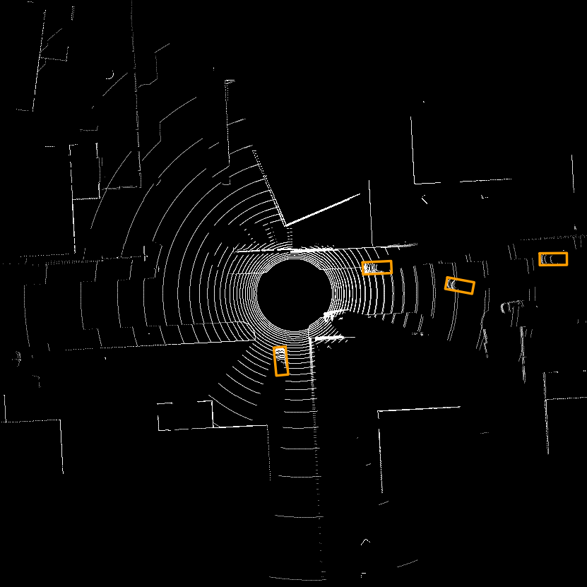
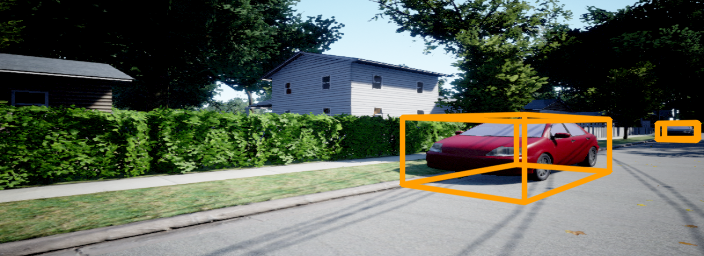

# Usage of BEVFusion inside the AirSim Simulator

## Description
This code is designed to test [BEVFusion model](https://github.com/mit-han-lab/bevfusion) which is introduced in the paper <BEVFusion: Multi-Task Multi-Sensor Fusion with Unified Bird's-Eye View Representation> in the AirSim simulator environment.

## How to use
If you download it, use the ```--recursive``` beside.

This code works inside the docker container. The given dockerfile is saved inside the DockerHub. You can just pull it.

and for the xhost, network connection, you should build the Docker container using the given ```docker-compose.yml```.
```bash
docker compose up -d
```
In the ```docker-compose.yml```, you must connect your repository in your local environment with those in Docker container.
```yml
    volumes:
      - [THIS DIRECTORY]:/workspace/bevfusion
      - [THIS DIRECTORY]/bevfusion:/workspace/bevfusion
      - [REPOSITORY OF DATASET]:/dataset
      - /home/[USERNAME]/Documents/AirSim:/airsim
```
Inside the docker container, you should run the command:

```bash
python3 setup.py develop
```


Then just turn on the airsim simulation outside of your Docker container! The interaction will be successful.

This initial code was tested by [AirSimNH.zip](https://github.com/microsoft/airsim/releases) in the linux environment, with the pretrained model in the 
You can see the outcome pictures like this:



